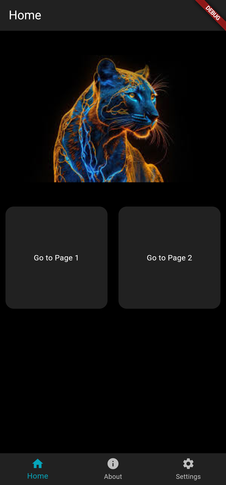
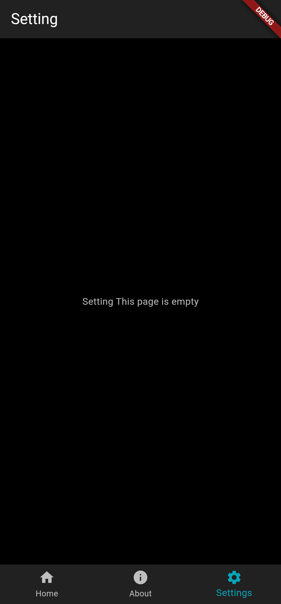

# Flutter Templates

A new Flutter project.

## Version Build

- Flutter 3.24.2
- Tools • Dart 3.5.2 • DevTools 2.37.2

## Run Project

- `git clone https://github.com/fitri-hy/flutter-templates.git`
- `cd flutter-templates`
- `flutter pub get`
- `flutter run`

  
  
  
  

